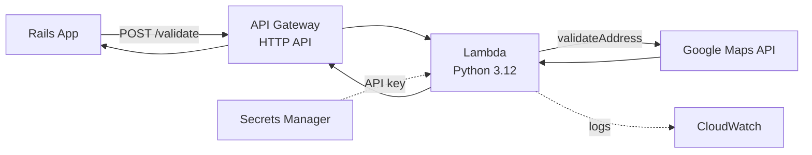

# Address Validation Service

AWS Lambda service that validates and normalizes postal addresses using the [Google Maps Address Validation API](https://developers.google.com/maps/documentation/address-validation).

## Architecture



```
Rails App (AddressValidationJob)
  └─ POST /validate
       └─ API Gateway (HTTP API)
            └─ Lambda (Python 3.12)
                 ├─ Google Maps Address Validation API
                 └─ Returns normalized address fields

Supporting services:
  ├─ Secrets Manager → Google Maps API key
  ├─ CloudWatch → Lambda logs
  └─ IAM → least-privilege execution role
```

## API

Full OpenAPI 3.1 spec: [`docs/openapi.yaml`](docs/openapi.yaml)

### `POST /validate`

Validate and normalize an address. Requires an `x-api-key` header.

**Request:**

```sh
curl -X POST https://<api-id>.execute-api.us-east-2.amazonaws.com/validate \
  -H "Content-Type: application/json" \
  -H "x-api-key: <your-api-key>" \
  -d '{
    "address": {
      "lines": ["1600 Amphitheatre Parkway"],
      "city": "Mountain View",
      "state": "CA",
      "postal_code": "94043",
      "country": "US"
    }
  }'
```

**Response (200):**

```json
{
  "line1": "1600 Amphitheatre Pkwy",
  "line2": null,
  "city": "Mountain View",
  "state": "CA",
  "postal_code": "94043-1351",
  "country": "US"
}
```

**Error (403 — missing or invalid API key):**

```json
{
  "message": "Forbidden"
}
```

**Error (400):**

```json
{
  "error": "address.lines must be a non-empty array of strings"
}
```

**Error (502):**

```json
{
  "error": "Google Maps API request timed out"
}
```

### Request fields

| Field | Type | Required | Default | Description |
|-------|------|----------|---------|-------------|
| `address.lines` | `string[]` | yes | — | Street address lines |
| `address.city` | `string` | no | `""` | City or locality |
| `address.state` | `string` | no | `""` | State or administrative area |
| `address.postal_code` | `string` | no | `""` | ZIP or postal code |
| `address.country` | `string` | no | `"US"` | ISO 3166-1 alpha-2 country code |

### Response fields

| Field | Type | Description |
|-------|------|-------------|
| `line1` | `string` | Primary street address |
| `line2` | `string \| null` | Secondary line (unit, suite) or null |
| `city` | `string` | City or locality |
| `state` | `string` | State abbreviation |
| `postal_code` | `string` | ZIP code (may include +4) |
| `country` | `string` | ISO 3166-1 alpha-2 code |

## Prerequisites

- Python 3.12
- Docker (for local invocation)
- [Terraform CLI](https://developer.hashicorp.com/terraform/install)
- AWS account with credentials configured

## Setup

```sh
bin/setup
source .venv/bin/activate
```

## Running checks

```sh
bin/ci
```

Or individually:

```sh
ruff check src tests           # lint
ruff format --check src tests  # format check
mypy                           # type check
pytest                         # tests
```

## Local invocation

Run the Lambda locally using the AWS Lambda Runtime Interface Emulator:

```sh
cp .env.example .env  # add your API key
docker compose up --build
```

Then invoke:

```sh
curl -X POST "http://localhost:9000/2015-03-31/functions/function/invocations" \
  -H "Content-Type: application/json" \
  -d '{"body": "{\"address\": {\"lines\": [\"1600 Amphitheatre Parkway\"], \"city\": \"Mountain View\", \"state\": \"CA\", \"postal_code\": \"94043\", \"country\": \"US\"}}"}'
```

## Infrastructure

See [`terraform/`](terraform/) for the AWS infrastructure:

| Resource | Purpose |
|----------|---------|
| Lambda | Python 3.12 function running the handler |
| API Gateway | HTTP API with `POST /validate` route |
| IAM | Least-privilege execution role |
| Secrets Manager | Google Maps API key (value set out-of-band) |
| CloudWatch | Lambda log group with retention policy |

### Deployment

Merges to `main` trigger automated deployment via [GitHub Actions](.github/workflows/deploy.yml):

1. Package Lambda (install deps + zip)
2. `terraform apply`
3. Smoke test against the live endpoint

PRs run `terraform plan` and post the output as a comment.

## License

[MIT](LICENSE)
